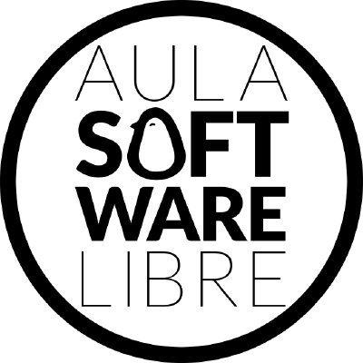

# Taller de iniciación a git

Este taller forma parte de las actividades del [Aula de Software Libre de la
Universidad de Córdoba](https://www.uco.es/aulasoftwarelibre).

El contenido del mismo es en parte de producción propia, en parte de otros
manuales libres que pueden encontrarse en la sección de [Referencias](referencias.md).

#Contenido
  * Inicio
  * Introducción a Git
  * Instalación y configuración de git
  * Uso básico
  * Uso avanzado
  * Ramas
  * Entornos gráficos 
  * Github
  * Flujo de trabajo con Git (git flow)
  * Referencias
