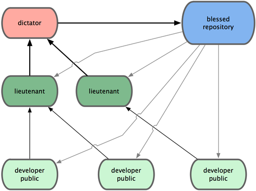

# Introducción a git

Git es un sistema de control de versiones distribuido que se diferencia del resto en el modo en que modela sus datos. La mayoría de los demás sistemas almacenan la información como una lista de cambios en los archivos, mientras que Git modela sus datos más como un conjunto de instantáneas de un mini sistema de archivos.

## Los tres estados

Git tiene tres estados principales en los que se pueden encontrar tus archivos: confirmado (committed), modificado (modified), y preparado (staged). Confirmado significa que los datos están almacenados de manera segura en tu base de datos local. Modificado significa que has modificado el archivo pero todavía no lo has confirmado a tu base de datos. Preparado significa que has marcado un archivo modificado en su versión actual para que vaya en tu próxima confirmación.

Esto nos lleva a las tres secciones principales de un proyecto de Git: el directorio de Git (Git directory), el directorio de trabajo (working directory), y el área de preparación (staging area).

## Flujos de trabajo distribuidos con git

Hemos visto en qué consiste un entorno de control de versiones distribuido, pero más allá de la simple definición, existe más de una manera de gestionar los repositorios. Estos son los flujos de trabajo más comunes en Git.

### Flujo de trabajo centralizado

Existe un único repositorio o punto central que guarda el código y todo el mundo sincroniza su trabajo con él. Si dos desarrolladores clonan desde el punto central, y ambos hacen cambios; tan solo el primero de ellos en enviar sus cambios de vuelta lo podrá hacer limpiamente. El segundo desarrollador deberá fusionar previamente su trabajo con el del primero, antes de enviarlo, para evitar el sobreescribir los cambios del primero

### Flujo de trabajo del Gestor-de-Integraciones

Al permitir múltiples repositorios remotos, en Git es posible tener un flujo de trabajo donde cada desarrollador tenga acceso de escritura a su propio repositorio público y acceso de lectura a los repositorios de todos los demás. Habitualmente, este escenario suele incluir un repositorio canónico, representante "oficial" del proyecto.

!!! info
    Este modelo se puso muy de moda a raíz de la forja GitHub que se verá más adelante.

### Flujo de trabajo con Dictador y Tenientes

Es una variante del flujo de trabajo con múltiples repositorios. Se utiliza generalmente en proyectos muy grandes, con cientos de colaboradores. Un ejemplo muy conocido es el del kernel de Linux. Unos gestores de integración se encargan de partes concretas del repositorio; y se denominan tenientes. Todos los tenientes rinden cuentas a un gestor de integración; conocido como el dictador benevolente. El repositorio del dictador benevolente es el repositorio de referencia, del que recuperan (pull) todos los colaboradores.

